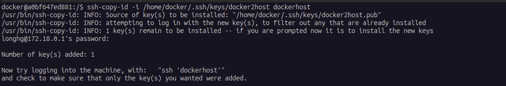

# Building Docker images when running containerised GitHub Actions
 Containerised GH action runner that connect to Docker on the host

---
## Introduction

Let's say, (hypothetically,) you don't want to install a lot of things to your computer and leave a huge mess, just to use them temporarily (e.g. software building tools) then forget where to find and delete (yeah, installing packages in Linux can be an intense pain in the @rse at times). As a result, you might want to install them to a temporary, yet isolated environment.

Virtual Machines is too bulky and resource-demanding for you, and you see isolated kernel space as unnecessary ? Bingo, let's tuck them all inside a Docker container. That's what I'm talking about running GitHub Actions in Docker. Things should be not too difficult as there are already a number of blogs that instruct you to do that. But then, what if your workflow includes Docker container building ?

## The problem

Running Docker and building a Docker container inside a Docker container (nested-Docker), while possible, is heavily not recommended. Jérôme Petazzoni — the author of the feature that made it possible for Docker to run inside a Docker container — actually wrote [a blog post](https://jpetazzo.github.io/2015/09/03/do-not-use-docker-in-docker-for-ci/) saying not to do it. He addresses a few problems which I will re-tell here:

1. Some Linux Security Modules (e.g. AppArmor and SELinux) running to the following situation: when starting a container, the “inner Docker” might try to apply security profiles that will conflict or confuse the “outer Docker.” From that blog, the "privileged" container class ran well in an Ubuntu and a Debian machine, but crashed on a (possible) Fedora machine. It was speculated that the differences between AppArmor and SELinux could be to blame for that.

1. Problems with file system compatibility: When running Docker in Docker, the outer Docker runs on top of a normal filesystem (EXT4, BTRFS, anything you've got) but the inner Docker runs on top of a copy-on-write system (AUFS, BTRFS, Device Mapper, etc., depending on what is set up for the outer Docker). Many combinations don't work (AUFS on AUFS). For BTRFS on BTRFS, running nested sub-volumes will hinder the removal of the parent sub-volumes. Device Mapper is not namespaced, meaning multiple Docker instances can see and affect each other's image, which nullify a major goal to use Docker - isolation. Though there are workarounds, they are not straightforward and you can make a huge mess on your computer trying to follow them.

1. Build cache and Images sharing between the host and the outer container... Ah yes ! The Docker daemon was explicitly designed to have exclusive access to /var/lib/docker. Nothing else should touch, poke, or tickle any of the Docker files hidden there. Try running two containers with access to the same `/var/lib/docker` on the host, then pull the image from the two daemons at the same times, and you'll see the devil being unleashed.

Said blog had also suggest mounting the socket to the container as volume using this command:

```bash
docker run -v /var/run/docker.sock:/var/run/docker.sock ...
```

However, I'm concerned that access to the socket file from the host may be affected once it is mounted as docker volumes (but hey, how can you control a container if you can't access the socket). Another thing that cross my mind is security, what if the something is wrong with the container and it affects the files in the volumes, including the `docker.sock` that I've just mounted.

## My solution

Luckily, the Docker client allows for a thing called **_SSH remote access_**. With this, the Docker client can access the remote Docker server and let it execute the commands instead. Docker provides support for running on remote docker engines through the use of the `DOCKER_HOST` environment variable and `-H`, `--host` command line option. However, this might not be a clean-looking and user friendly option, as every command would need these variable and would be long as heck.

Fortunately again, Docker has a feature called **_"context"_**. Each context contains all information required (including the **Endpoint**) to manage resources on the target daemon. You can set a context to target a remote Docker server over SSH using:

```bash
docker context create remote ‐‐docker “host=ssh://user@remotemachine”
```

After that, you can run a command to check it out, the output should look like this:

```bash
docker context ls
```
```
NAME      DESCRIPTION            DOCKER ENDPOINT    KUBERNETES ENDPOINT     ORCHESTRATOR
default * Current DOCKER_HOST…   unix:///var/run/docker.sock                swarm
remote                           ssh://user@remotemachine
```
Look at the **`remote`** context.

Basically, the Docker client inside the Build or CI/CD container calls the Docker server in your host machine and let it build (and push) the images.

Also, if you want to use the remote context constantly without having to provide the `--context` option in every single commands, you can run the following command:

```bash
docker context use remote
```

Well done, but here's come the next problems.

## It's not as straightforward as you initially think

The Actions workflows should be non-interactive. However, switching to the remote context does not make the Docker CLI automatically logged into the remote server. You must be logged in and out for each and every commands. If you use the password-base login method, you will have to enter it every time a command is executed. Mamma mia, non va bene !

So, the key pair method is used. A key pair generated inside the container, public given to the host, the container uses the private key to log in. It should be a bit more secure in this way.

Well, a few more steps must be done.

After initialising a container, you will have to go to its shell:

```bash
docker exec -it <container-name> bash
```

then run the following command inside that shell:

```bash
ssh-copy-id -i /home/docker/.ssh/keys/docker2host dockerhost
```

You will be asked to enter the password of the user inside the host (see the `User` parameter in the `ssh/config` file in this repository to know which user are you are logging in as).



After that, you've successfully added the public key to your host user as an authorised key.

The `ssh/config` file also contains the line `StrictHostKeyChecking no`. This ensures that the login process will not ask you to answer the `yes/no/fingerprint` for adding to known-hosts on your first command. A better way is to remove said line from the file before building the image, then try to log in with `ssh dockerhost` and answer said question in the container shell.

## Last words

If you have done all the steps above and scroll down to this point, your Actions container is basically ready to go.